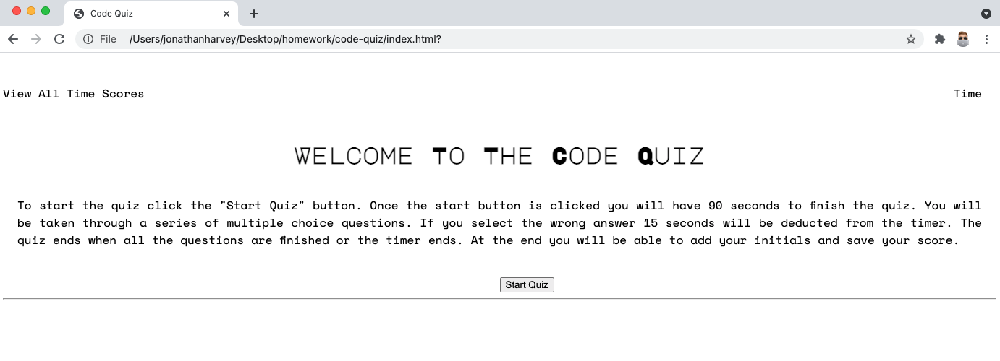

# Code Quiz

## Background

This was a homework assignment for the UofT Bootcamp.  Below is the story and acceptance criteria for reference.

## User Story

```
AS A coding boot camp student
I WANT to take a timed quiz on JavaScript fundamentals that stores high scores
SO THAT I can gauge my progress compared to my peers
```

## Acceptance Criteria

```
GIVEN I am taking a code quiz
WHEN I click the start button
THEN a timer starts and I am presented with a question
WHEN I answer a question
THEN I am presented with another question
WHEN I answer a question incorrectly
THEN time is subtracted from the clock
WHEN all questions are answered or the timer reaches 0
THEN the game is over
WHEN the game is over
THEN I can save my initials and my score
```

## Process

* For this assignment we had to start from scratch, so I started with a basic structure in HTML and got cracking on the JavaScript side of things.
* For the JavaScript I started pseudocoding first, which helped me get an idea for the fuctions and helper functions I was going to need.  Once those were sorted and functioning properly I cleaned up the HTML and added styling with CSS.
* For me the biggest challenge duirng this assignment where looping through the questions array.
* Credit to my tutor and TA's for their help.

## Screen Shot



## Link

https://harviator.github.io/code-quiz/